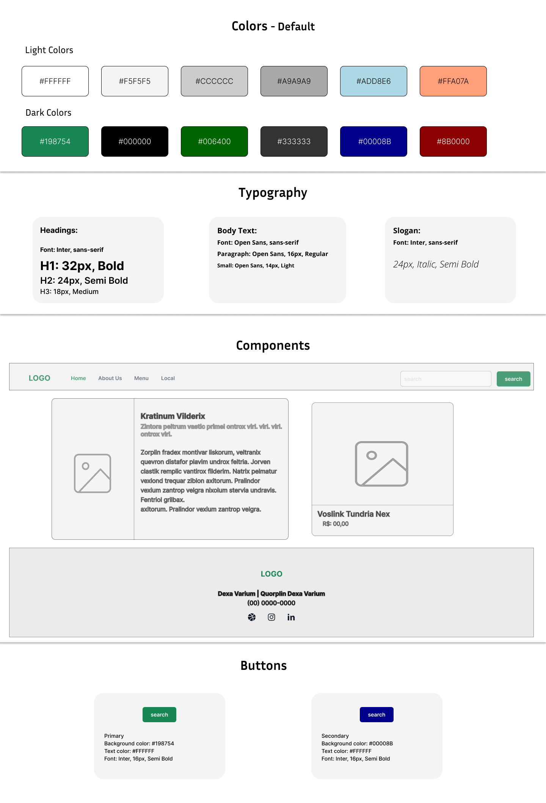

# Design System

  

## Descrição  
Design System desenvolvido durante a formação **UX Designer** da [Digital Innovation One](https://www.dio.me/).  
Este sistema fornece diretrizes e componentes reutilizáveis para garantir consistência em toda a interface do usuário.

## Ferramenta Utilizada  
- **Figma**

## Conteúdo  
- **Cores**: Divididas em duas categorias: Light Colors (cores claras) e Dark Colors (cores escuras).  
- **Tipografia**: Composta por três categorias: cabeçalho, corpo do texto e slogan.  
- **Componentes**: Inclui header, card de conteúdo, card de produto e footer.  
- **Botões**: Dois tipos disponíveis: primário e secundário.  

## Como Visualizar  
1. Faça o download do arquivo do repositório.  
2. Abra o arquivo no **Figma**.  
3. Explore o layout e os fluxos propostos.  

> **Nota:** Certifique-se de ter uma conta no [Figma](https://figma.com) para abrir o arquivo corretamente.
